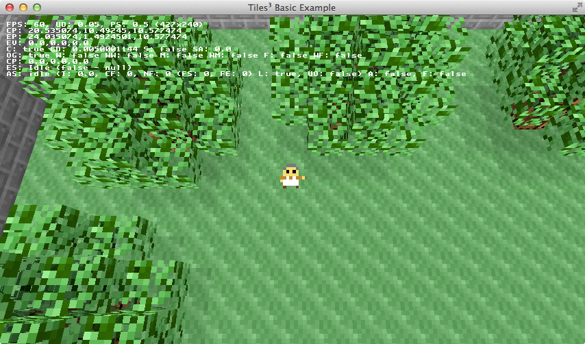

# Tiles³ Framework: Basic Example

A basic working example application of the "Tiles³ Framework" in action. This just
show cases a complete but very, very simple application that makes use of:

* [libGDX](http://libgdx.badlogicgames.com/)
* [gdx-toolbox](https://github.com/gered/gdx-toolbox)
* [gdx-tilemap3d](https://github.com/gered/gdx-tilemap3d)
* Basic custom entity/event system and gameplay handling code.

This basic example is nothing more then a boring walk-around demo. Nothing too
exciting as you would expect from something called a "basic example."

## What is the "Tiles³ Framework"?

This is what I'm calling my own custom "framework" (and I'm using the word loosely here)
for building 3D tile-based top-down real-time action games. This framework is built upon
libGDX and my own libraries gdx-toolbox and gdx-tilemap3d and builds on the entity and
event system in those with a bunch of pre-built subsystems somewhat suitable for building
games. 

**This is NOT intended to be a generic game engine / library.** Rather, it is just my
common game template (for these specific types of games) which I'm giving a name
and putting up for anyone else to use. You will _very likely_ want to heavily
customize this, assuming it even meets your needs at all!

## Running

You will need Gradle. Clone the repository and then from a terminal:

	$ gradle desktop:run
	
And it should download the project dependencies, build and then run.

## TODO

[[Write something here briefly explaining the project and code structure]]

## License

Distributed under the the MIT License. See LICENSE for more details.
